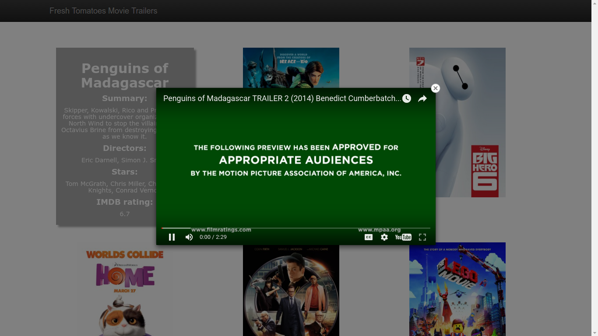

# Movies Trailer Website

> A simple website to show movie information including their trailers.

## Installation

Things you'll need to install to make the site work - 

[pip](https://pip.pypa.io/en/stable/) - The PyPA recommended tool for installing Python packages.

`sudo apt-get install python-pip`

After installing pip - 
[Requests](http://docs.python-requests.org/en/master/) - Requests is the only Non-GMO HTTP library for Python, safe for human consumption.

`pip install requests`

[Beautiful Soup](https://www.crummy.com/software/BeautifulSoup/bs4/doc/) - Beautiful Soup is a Python library for pulling data out of HTML and XML files.

`pip install beautifulsoup4`

### Alternative

`pip install -r requirements.txt` (Does the same thing as above)

## Usage

To open up the website in the browser - 

`python media_center.py`

Try _hovering over_ the movie posters to reveal more information about that movie.
_Click_ on any poster to watch the corresponding trailer.

#### API used -
 [OMDb](http://www.omdbapi.com/) - Extracted movie information like stars, directors, IMDb rating, plot from a JSON structure
#### Problems which may occur

If you come across `InsecurePlatformWarning` please refer to this [resolved issue](https://github.com/nirajpandkar/MovieTrailerWebsite/issues/3).
## Contributing

You can add movies to the media_center.py in the following way - 
`movie_name_variable = media.Movie('movie_name')`

Also don't forget to add the movie_name_variable to the movies list - 
`movies = [movie1, movie2, movie_name_variable]`

## Licence

MIT [Niraj Pandkar](https://github.com/nirajpandkar)